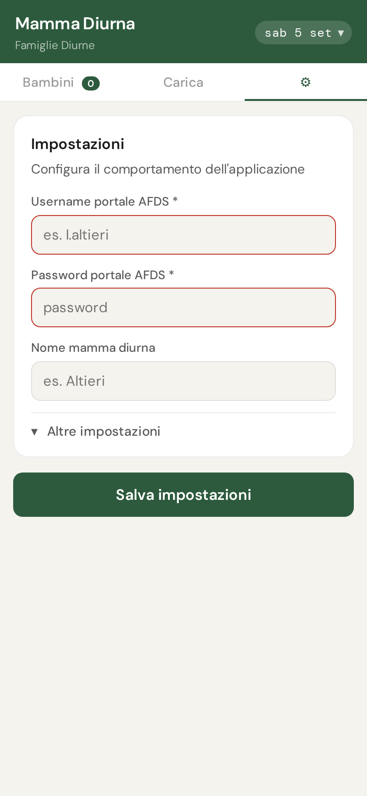
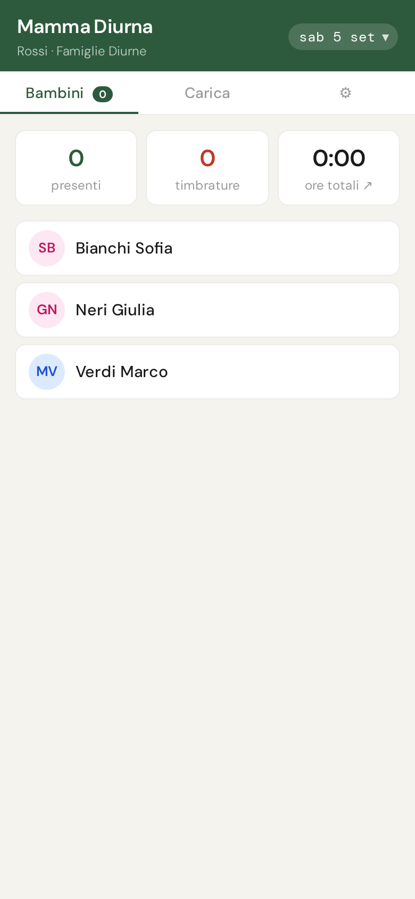
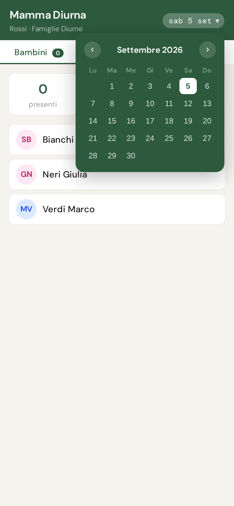
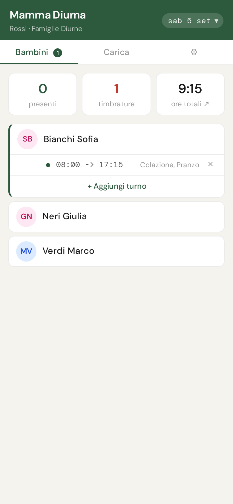
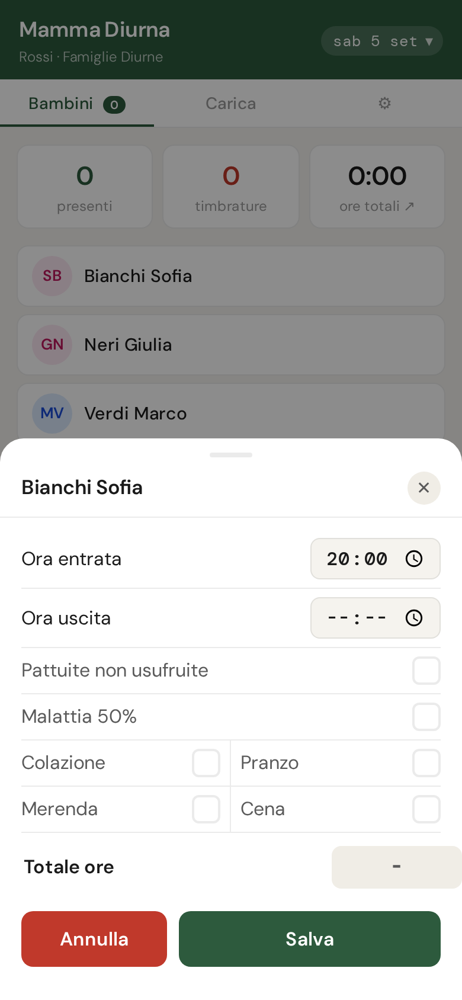
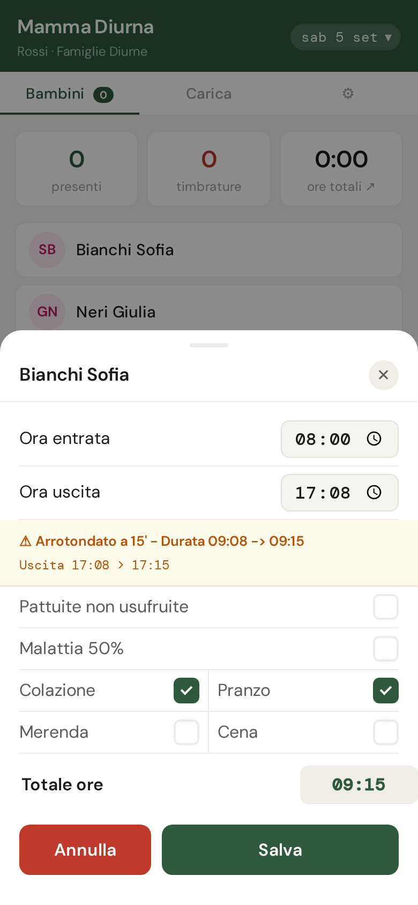
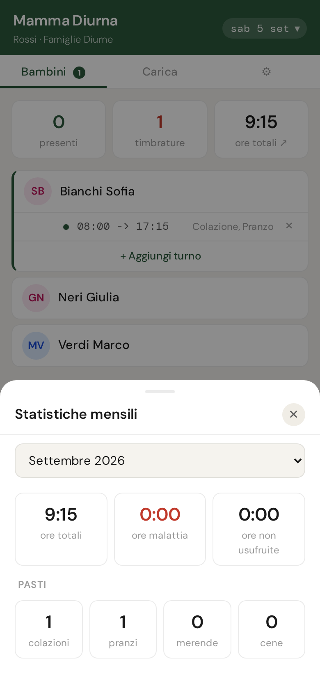
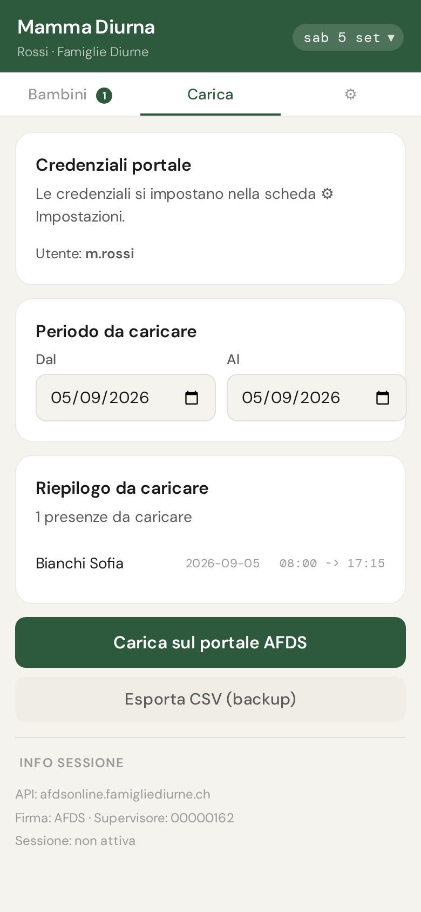
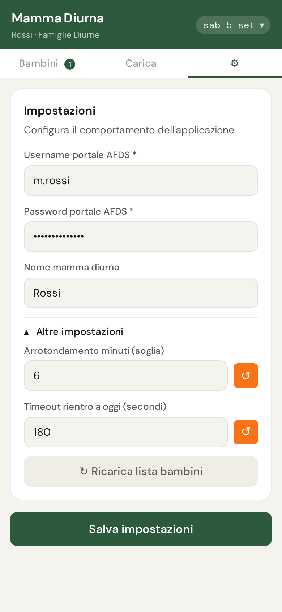

# Mamma Diurna

## Manuale utente

{width=140px}

**Autore:** Giovanni Ugo Altieri
**Data:** settembre 2026

---

## 1. Cos'è Mamma Diurna

**Mamma Diurna** è un'app per smartphone che ti permette di registrare le presenze dei bambini che accudisci e di caricarle sul portale AFDS (Associazione Famiglie Diurne Svizzera) con un solo tocco.

L'app funziona come un'applicazione web installabile: si aggiunge direttamente dal browser alla schermata principale del telefono, senza passare dall'App Store o da Google Play, e funziona anche senza connessione internet per la registrazione delle presenze.

> **Nota:** l'app Mamma Diurna è sviluppata e gestita da Giovanni Ugo Altieri (Faido). Non è un prodotto AFDS.

---

## 2. Installazione

```{=opendocument}
<text:p text:style-name="Riquadro"><text:span text:style-name="RiquadroBold">📲 Indirizzo dell'app:</text:span><text:line-break/><text:span text:style-name="RiquadroMono">https://mammadiurna-app.github.io/app/</text:span></text:p>
```

### Su iPhone / iPad (Safari)

1. Apri Safari e vai all'indirizzo dell'app.
2. Tocca l'icona **Condividi** (il quadrato con la freccia in su) nella barra degli strumenti.
3. Scorri verso il basso e tocca **"Aggiungi a schermata Home"**.
4. Conferma toccando **Aggiungi** in alto a destra.

L'app apparirà nella schermata Home come qualsiasi altra app.

### Su Android (Chrome)

1. Apri Chrome e vai all'indirizzo dell'app.
2. Tocca i tre puntini in alto a destra.
3. Tocca **"Aggiungi a schermata Home"** (o "Installa app").
4. Conferma.

---

## 3. Primo avvio — Impostazioni

Al primo avvio l'app mostra la schermata principale vuota. Prima di poter usare l'app devi inserire le tue credenziali del portale AFDS.

Tocca la scheda **⚙** (Impostazioni) in alto a destra nella barra di navigazione.

+------------------------------------------------------------------------------+--------------------------------------------------------------------------------------------------+
| Compila i campi:                                                             | {width=170px}|
|                                                                              |                                                                                                  |
| - **Username portale AFDS** — il tuo nome utente per accedere al portale AFDS|                                                                                                  |
|   (es. `l.altieri`). Il campo "Nome mamma diurna" si compila                 |                                                                                                  |
|   automaticamente con la parte dopo il punto.                                |                                                                                                  |
| - **Password portale AFDS** — la tua password.                               |                                                                                                  |
| - **Nome mamma diurna** — il tuo cognome o nome come vuoi che appaia         |                                                                                                  |
|   nell'app (si auto-compila, ma puoi modificarlo).                           |                                                                                                  |
|                                                                              |                                                                                                  |
| Tocca **Salva impostazioni**. L'app caricherà automaticamente la lista       |                                                                                                  |
| dei bambini dal portale e tornerà alla schermata principale.                 |                                                                                                  |
+------------------------------------------------------------------------------+--------------------------------------------------------------------------------------------------+

> **Nota:** le credenziali vengono salvate solo sul tuo telefono e non vengono mai trasmesse a terzi, se non per effettuare l'accesso al portale AFDS.

---

## 4. Schermata principale — Bambini

+------------------------------------------------------------------------+---------------------------------------------------------------------------------+
| La schermata principale mostra la lista dei bambini che accudisci nella| {width=170px}|
| data selezionata.                                                      |                                                                                 |
+------------------------------------------------------------------------+---------------------------------------------------------------------------------+

### 4.1 La barra verde in cima

- **Data** (pillola a sinistra) — mostra il giorno selezionato. Tocca per aprire il calendario e cambiare data.
- **Nome** — il tuo nome/cognome come configurato nelle Impostazioni.

#### Cambiare data

+-------------------------------------------------------------------------+----------------------------------------------------------------------------------------------------+
| Tocca la pillola con la data per aprire il calendario. Puoi navigare tra| {width=170px}|
| i mesi con le frecce `‹` e `›`, poi tocca il giorno che ti interessa.   |                                                                                                    |
+-------------------------------------------------------------------------+----------------------------------------------------------------------------------------------------+

Quando navighi in una data diversa da oggi, l'app mostra un **avviso giallo** sotto la barra verde come promemoria. Dopo alcuni minuti di inattività (configurabili nelle Impostazioni), l'app torna automaticamente alla data odierna.

### 4.2 Le statistiche del giorno

Sotto la barra di navigazione compaiono tre riquadri:

| Riquadro | Significato |
|----------|-------------|
| **Presenti** | Numero di bambini con almeno una timbratura nella data selezionata |
| **Timbrature** | Numero totale di turni registrati (un bambino può avere più turni) |
| **Ore totali ↗** | Somma delle ore lavorate nella data selezionata. Tocca per aprire le statistiche mensili. |

### 4.3 Le schede bambini

+-----------------------------------------------------------------------+------------------------------------------------------------------------------------------------------+
| Ogni bambino appare come una riga. Se ha timbrature per la data       | {width=170px}|
| selezionata, la scheda mostra un bordo verde a sinistra e l'elenco dei|                                                                                                      |
| turni registrati.                                                     |                                                                                                      |
|                                                                       |                                                                                                      |
| Per ogni turno registrato vedi:                                       |                                                                                                      |
|                                                                       |                                                                                                      |
| - **Orario entrata → orario uscita** (in carattere monospace)         |                                                                                                      |
| - Eventuali note (pasti, malattia, pattuite)                          |                                                                                                      |
| - Un pulsante **✕** per eliminare il turno                            |                                                                                                      |
+-----------------------------------------------------------------------+------------------------------------------------------------------------------------------------------+

Se un bambino ha già un turno ma vuoi aggiungerne un secondo (es. rientro pomeridiano), tocca la riga **"+ Aggiungi turno"** che appare sotto i turni esistenti.

---

## 5. Registrare una presenza

+-----------------------------------------------------------------------+-----------------------------------------------------------------------------------------------------------+
| Tocca il nome di un bambino per aprire il pannello di registrazione.  | {width=170px}|
|                                                                       |                                                                                                           |
| 1. **Ora entrata** — tocca il campo e inserisci l'orario di arrivo del|                                                                                                           |
|    bambino.                                                           |                                                                                                           |
| 2. **Ora uscita** — tocca il campo e inserisci l'orario di partenza.  |                                                                                                           |
| 3. **Totale ore** — si calcola automaticamente non appena inserisci   |                                                                                                           |
|    entrambi gli orari.                                                |                                                                                                           |
+-----------------------------------------------------------------------+-----------------------------------------------------------------------------------------------------------+

+----------------------------------------------------------------------+-----------------------------------------------------------------------------------------------------+
| > **Arrotondamento automatico:** se l'orario di uscita è a meno di 6 | {width=170px}|
| > minuti dal quarto d'ora successivo (es. 17:07 anziché 17:15), l'app|                                                                                                     |
| > mostra un avviso giallo e arrotonda automaticamente. La soglia è   |                                                                                                     |
| > configurabile nelle Impostazioni avanzate.                         |                                                                                                     |
+----------------------------------------------------------------------+-----------------------------------------------------------------------------------------------------+

### Caselle opzionali

- **Pattuite non usufruite** — spunta se il bambino era previsto ma non è venuto (ore da retribuire comunque per contratto).
- **Malattia 50%** — spunta se il bambino è malato (retribuzione al 50%).
- **Pasti** (Colazione / Pranzo / Merenda / Cena) — spunta i pasti consumati dal bambino durante la giornata.

Tocca **Salva** per confermare. Il turno appare immediatamente nella scheda del bambino.

---

## 6. Statistiche mensili

+------------------------------------------------------------------------+-------------------------------------------------------------------------------+
| Tocca il riquadro **"Ore totali ↗"** nella barra statistiche per aprire| {width=170px}|
| il pannello delle statistiche mensili. Il pannello mostra:             |                                                                               |
|                                                                        |                                                                               |
| - **Selettore mese** — cambia mese con il menu a tendina per vedere i  |                                                                               |
|   totali di altri mesi.                                                |                                                                               |
| - **Ore totali del mese** — somma di tutti i turni registrati nel mese |                                                                               |
|   selezionato.                                                         |                                                                               |
| - **Pasti** — conteggio dei pasti registrati nel mese, suddivisi per   |                                                                               |
|   tipo.                                                                |                                                                               |
+------------------------------------------------------------------------+-------------------------------------------------------------------------------+

Tocca **✕** o fuori dal pannello per chiuderlo.

---

## 7. Caricare le presenze sul portale AFDS

+-----------------------------------------------------------------------+-----------------------------------------------------------------------------------------+
| Quando vuoi inviare le presenze al portale AFDS, tocca la scheda      | {width=170px}|
| **Carica** nella barra di navigazione.                                |                                                                                         |
|                                                                       |                                                                                         |
| 1. **Periodo** — i campi "Da" e "A" delimitano l'intervallo di date da|                                                                                         |
|    caricare.                                                          |                                                                                         |
| 2. **Riepilogo** — l'app mostra l'elenco di tutte le presenze nel     |                                                                                         |
|    periodo scelto: quelle ancora da caricare in carattere normale,    |                                                                                         |
|    quelle già caricate in precedenza in grigio con un segno ✓.        |                                                                                         |
| 3. **Carica sul portale** — tocca il pulsante per avviare il          |                                                                                         |
|    caricamento.                                                       |                                                                                         |
+-----------------------------------------------------------------------+-----------------------------------------------------------------------------------------+

Durante il caricamento vedi un indicatore di avanzamento (es. "Caricamento 2/5..."). Al termine, l'app mostra un messaggio di conferma o segnala eventuali errori.

> I turni già caricati in precedenza (mostrati in grigio nel riepilogo) non vengono ricaricati: se hai bisogno di correggerne uno, devi prima cancellarlo direttamente dal portale AFDS, altrimenti il nuovo invio non avrà effetto.

### Esportare le presenze in Excel

Nella stessa pagina, il pulsante **"Esporta XLS"** genera un file Excel con il riepilogo delle presenze del periodo selezionato (stesse date "Da"/"A"): un bambino per riga, gli orari di entrata/uscita per ogni giorno del periodo e il totale ore per bambino, con il totale complessivo in fondo. È utile per archiviare o consegnare un resoconto leggibile, indipendentemente dal caricamento sul portale.

Sul telefono, toccando "Esporta XLS" si apre direttamente il **pannello di condivisione** (lo stesso che compare condividendo una foto): da lì puoi inviare il file via e-mail, WhatsApp, AirDrop o qualsiasi altra app installata, senza dover prima passare dall'app "File". Se il telefono/browser non supporta questa funzione, il file viene scaricato normalmente nella cartella Download/File.

---

## 8. Impostazioni avanzate

+--------------------------------------------------------------------+------------------------------------------------------------------------------------------+
| Nella scheda **⚙ Impostazioni**, tocca **"Altre impostazioni"** per| {width=170px}|
| espandere le opzioni avanzate.                                     |                                                                                          |
+--------------------------------------------------------------------+------------------------------------------------------------------------------------------+

| Impostazione | Valore default | Significato |
|---|---|---|
| **Arrotondamento minuti (soglia)** | 6 | Se l'uscita è entro N minuti dal quarto d'ora, viene arrotondata automaticamente al quarto d'ora successivo |
| **Timeout rientro a oggi** | 180 secondi | Dopo quanti secondi di inattività l'app torna automaticamente alla data odierna |

### Ricarica lista bambini

Se la lista dei bambini è vuota o non aggiornata (es. è stato aggiunto un nuovo bambino sul portale), tocca **"↻ Ricarica lista bambini"**. L'app si connette al portale AFDS e aggiorna la lista.

---

## 9. Aggiornamenti dell'app

Quando è disponibile una nuova versione, l'app mostra un **avviso** in cima alla schermata:

> *"Nuova versione disponibile — Tocca per aggiornare"*

Tocca l'avviso per aggiornare immediatamente. L'app si ricarica e la nuova versione è attiva.

---

## 10. Licenza — scadenza e rinnovo

L'app verifica automaticamente la validità della tua licenza ogni volta che apri la scheda di un bambino.

| Avviso | Cosa significa | Cosa fare |
|--------|---------------|-----------|
| **Rinnovo in scadenza** | La licenza scade entro 10 giorni | Ricarica la licenza; puoi continuare a usare l'app |
| **Periodo di tolleranza** | La licenza è scaduta ma sei ancora nel periodo di tolleranza | Ricarica al più presto; puoi ancora registrare le date coperte |
| **Licenza scaduta** | Il periodo di tolleranza è terminato | Non è possibile registrare presenze; ricarica la licenza |
| **Data non coperta** | Stai inserendo una presenza in una data precedente all'inizio della tua licenza | Seleziona una data valida o contatta G. Altieri |

Gli avvisi informativi (rinnovo in scadenza / periodo di tolleranza) vengono mostrati una sola volta per ogni giorno di calendario: se chiudi l'avviso, non ricompare per quella stessa data.

Nelle schermate di avviso e blocco trovi il pulsante **"Ricarica licenza"** che ti porta direttamente alle istruzioni per il pagamento.

---

## 11. Come ricaricare la licenza

### Prezzi

| | Prezzo |
|---|---|
| **Mese singolo** | fr. 6.— |
| **3 mesi o più** | fr. 4.— al mese |

### Modalità di pagamento

**TWINT o telefono:**
077 499 6102

**Bonifico bancario:**
IBAN CH86 8035 0000 0093 5857 9 — intestato a Giovanni Ugo Altieri

Indica nel messaggio il tuo **nome utente AFDS** e il numero di mesi che desideri ricaricare.

La ricarica è attiva a partire dal giorno successivo al ricevimento del pagamento.

### Contatto

**Giovanni Ugo Altieri**
Via Canton Uri 27
6760 Faido
Tel. 077 499 6102

---

*Mamma Diurna — versione corrente disponibile su https://mammadiurna-app.github.io/app/*
